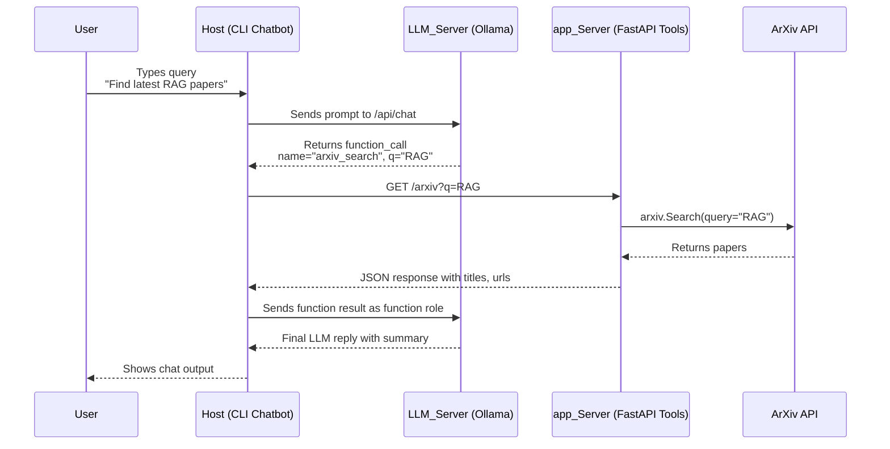

## Sequence Diagram

```mermaid
sequenceDiagram
    participant U as User
    participant Host as Host (CLI Chatbot)
    participant LS as LLM_Server (Ollama)
    participant app as app_Server (FastAPI Tools)
    participant Arxiv as ArXiv API

    U->>Host: Types query<br/>"Find latest RAG papers"
    Host->>LS: Sends prompt to /api/chat
    LS-->>Host: Returns function_call<br/>name="arxiv_search", q="RAG"
    Host->>app: GET /arxiv?q=RAG
    app->>Arxiv: arxiv.Search(query="RAG")
    Arxiv-->>app: Returns papers
    app-->>Host: JSON response with titles, urls
    Host->>LS: Sends function result as function role
    LS-->>Host: Final LLM reply with summary
    Host-->>U: Shows chat output
```

