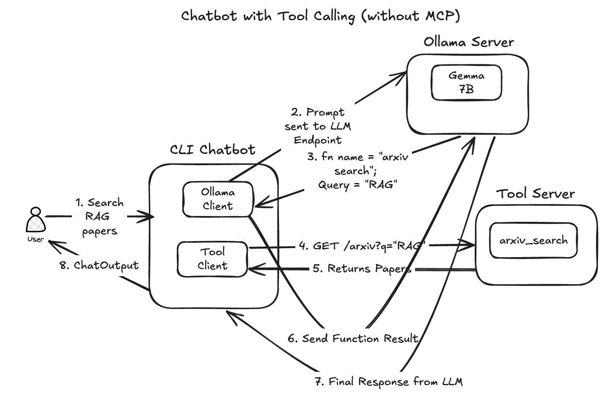
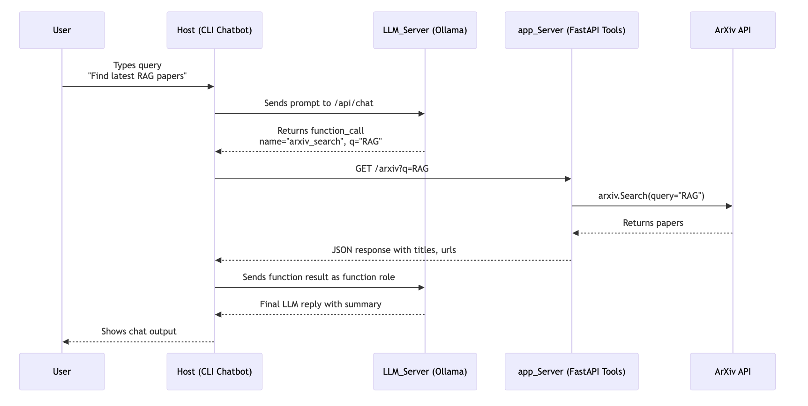
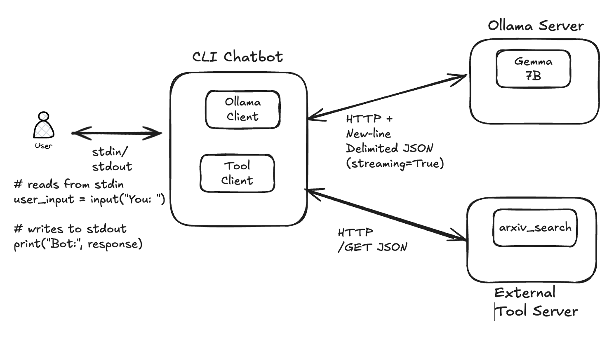

# 🧠 Ollama Function-Calling Chatbot (with Arxiv Tool)

A locally hosted chatbot powered by [Ollama](https://ollama.com), capable of **function calling** to fetch research papers from [arXiv.org](https://arxiv.org/). Uses `gemma:7b` as the LLM, `FastAPI` for serving tools, and Docker for local orchestration.

---

## ⚙️ Project Structure

```
.
└── ollama_function_calling_without_mcp
    ├── app_server
    │   ├── app_server.py
    │   ├── Dockerfile
    │   ├── requirements.txt
    │   └── tools.py
    ├── docker-compose.yml
    ├── host
    │   ├── cli_chatbot.py
    │   ├── Dockerfile
    │   ├── llama_client.py
    │   └── requirements.txt
    │   └── logger_config.py
    └── llm_server
        └── instructions.md
```

---

## What are we going to build?

- Logical components of the Chatbot


- How does the Input-Output Journey in the Chatbot happen?


- How the Chatbot Communicates?



---

## 🚀 Getting Started

### ✅ Step 1: Start the Ollama Server Manually (not used for AzureOpenAI)

Make sure you have Ollama installed and run the LLM (e.g. `gemma:7b`) outside Docker.

```bash
ollama pull gemma:7b
ollama run gemma:7b
```

> This starts the Ollama LLM server at http://localhost:11434.

---

### ✅ Step 2: Start the Tool Server and Chatbot Client Containers
- From the project root:

1. Start the FastAPI app_server in detached mode

```bash
cd ollama_function_calling_without_mcp
docker compose up -d --build app_server
```

2. Start the chatbot client (host) in interactive mode

```bash
docker compose run --rm host
```
This gives you a live CLI interface like:

```bash
You: Show me papers on retrieval augmented generation
Bot: 📄 "Retrieval-Augmented Generation for Knowledge-Intensive NLP Tasks" — [arxiv.org/...]
```

---


### Optional Step: 🔎 Health Checks

#### ✅ Ollama Health Check
The chatbot will automatically check if Ollama is running using /api/tags.

If not reachable:

❌ Ollama server not reachable. Please start it with:

    ollama run gemma:7b

#### ✅ Tool Server Health Check
You can verify that the app server is up:

```bash
curl http://localhost:8000/health
# {"status": "ok"}
```

---


### 📦 Requirements

```
Ollama
Docker + Docker Compose
Internet access (for arXiv API)
```

---

### 🧩 Supported Tools

🔍 Arxiv Search
Function: arxiv_search(q: str, max_results: int = 5)

Example Prompt:

“Search latest papers on reinforcement learning in arXiv.”

---

## How does the Communication happen between Client and Servers

### 🔸 1. Client (CLI) → Ollama Server
- ✅ Transport: streamable HTTP POST to /api/chat
- ✅ Protocol: JSON-over-HTTP (streamed line-by-line)
- ✅ Pattern: Client sends a message; receives streamed JSON chunks


### 🔸 2. Client (CLI) → Tool Server (app_server)
- ✅ Transport: Standard HTTP GET request (/arxiv?q=...)
- ✅ Protocol: JSON response, synchronous
- ✅ Pattern: Traditional HTTP API call

### 3. Client is the orchestrator
The CLI (cli_chatbot.py) acts as:

- Router: handles the LLM response
- Function-caller: detects function_call and delegates to tools
- Memory holder: maintains history in context

---

---

## Result

### Version 1: Without enabling debugging

- Since we have used a quantized model for the web

```bash
WARN[0000] /path/to/ollama_function_calling_without_mcp/docker-compose.yml: the attribute `version` is obsolete, it will be ignored, please remove it to avoid potential confusion 
[+] Creating 1/1
 ✔ Container ollama_function_calling_without_mcp-app_server-1  Running                                                                                                                                      0.0s 

💬 Chat started. Type 'exit' or 'quit' to stop.

You: can you search papers?
🤖 Bot: Yes, I can search for academic papers on various topics using arXiv. Please provide the specific topic or keywords you're interested in, and I'll find relevant papers for you.

You: oh yeah I forgot. Search papers on voice based LLMs
🔧 Tool called: search_papers with args: {'topic': 'voice based LLMs', 'max_results': 5}
🤖 Bot: Here are some papers related to voice-based large language models (LLMs) from arXiv:

1. **Title:** [VoxGPT: A Voice-based Large Language Model](https://arxiv.org/abs/2410.17196v3)
   - **Authors:** Not specified
   - **Abstract:** Not available
   - **Submission Date:** October 2024
   - **Link:** [arXiv:2410.17196v3](https://arxiv.org/abs/2410.17196v3)

2. **Title:** [Exploring Multimedia Input for Large Language Models: When Voice Meets Text](https://arxiv.org/abs/2409.15623v1)
   - **Authors:** Not specified
   - **Abstract:** Not available
   - **Submission Date:** September 2024
   - **Link:** [arXiv:2409.15623v1](https://arxiv.org/abs/2409.15623v1)

3. **Title:** [Voice and Text: Merging Modalities for Enhanced Language Understanding](https://arxiv.org/abs/2309.13879v2)
   - **Authors:** Not specified
   - **Abstract:** Not available
   - **Submission Date:** September 2023
   - **Link:** [arXiv:2309.13879v2](https://arxiv.org/abs/2309.13879v2)

4. **Title:** [Adapting Large Language Models for Voice Interaction: Methodologies and Challenges](https://arxiv.org/abs/2505.17093v1)
   - **Authors:** Not specified
   - **Abstract:** Not available
   - **Submission Date:** May 2025
   - **Link:** [arXiv:2505.17093v1](https://arxiv.org/abs/2505.17093v1)

5. **Title:** [Voice-Enhanced LLMs: Challenges and Opportunities](https://arxiv.org/abs/2505.22251v2)
   - **Authors:** Not specified
   - **Abstract:** Not available
   - **Submission Date:** May 2025
   - **Link:** [arXiv:2505.22251v2](https://arxiv.org/abs/2505.22251v2)

Please note that the abstracts are not listed. If you would like more information or a specific paper extracted, just let me know!

You: can you give me details about this paper - 2410.17196v3
🔧 Tool called: extract_info with args: {'paper_id': '2410.17196v3'}
🤖 Bot: The paper titled **"VoiceBench: Benchmarking LLM-Based Voice Assistants"** was authored by Yiming Chen, Xianghu Yue, Chen Zhang, Xiaoxue Gao, Robby T. Tan, and Haizhou Li. It was published on **October 22, 2024**.

### Summary:
This paper addresses the advancements in large language models (LLMs) such as GPT-4o that have enabled real-time speech interactions through LLM-based voice assistants, significantly enhancing the user experience compared to traditional text-based interactions. However, the authors note a critical gap in the current evaluation landscape: the lack of benchmarks that assess the capabilities of voice assistants in real-world scenarios involving diverse speaker characteristics and varying environmental conditions. Existing evaluation methods primarily focus on automatic speech recognition (ASR) or general knowledge assessments with clean, ideal speech input.

To tackle this issue, the authors introduce **VoiceBench**, the first benchmark specifically designed for a more comprehensive evaluation of LLM-based voice assistants. VoiceBench includes both real and synthetic spoken instructions that take into account three major real-world variations: diverse speaker characteristics, environmental factors, and content variations. The findings from extensive experiments underscore the limitations of the current LLM-based voice assistant models and provide insights for future research and development in this domain.

### Access the Paper:
You can read and download the paper from the following link: [VoiceBench: Benchmarking LLM-Based Voice Assistants (PDF)](http://arxiv.org/pdf/2410.17196v3).

```

### Logging outputs

```

```

---

## Issue I encountered

### ❓What Happens When stream=False (default)?

✉️ Code Before:

```python
response = requests.post(
    "http://host.docker.internal:11434/api/chat",
    json={"model": "gemma:7b", "messages": messages}
    # stream=False is default
)
response.json()
```

📦 Protocol Used:
- Transport: Regular HTTP POST
- Response: Ollama buffers the entire response into a single JSON object
- Protocol style: blocking HTTP, not streaming

You get something like:

```json
{
  "message": {
    "role": "assistant",
    "content": "Hello there!"
  }
}
```

⚠️ Problem:

- If Ollama returns a streaming NDJSON response by default, requests still buffers it all — and the resulting response body may look like:

```json
{"message": {"role": "assistant", "content": "Hello"}}
{"message": {"role": "assistant", "content": " there!"}}
```
This is not valid JSON, and calling response.json() fails with:

JSONDecodeError: Extra data: line 2 column 1 (char 123)
Because you're trying to decode a multi-document stream as a single JSON object — which is invalid.

✅ What Changes with stream=True?

✉️ Code After:

```python
response = requests.post(..., stream=True)

```


📦 Protocol Used:
- Still HTTP POST, but now:
- You’re telling requests not to read the full body at once
- You read it line-by-line using response.iter_lines()
- Each line is a valid JSON object — NDJSON protocol


---

## ⚠️ Disclaimer

> While all the above code has been verified and tested to function correctly, please note that parts of this were generated via vibe coding — assisted by AI tools to accelerate experimentation. Review and adapt to your own development standards where needed.