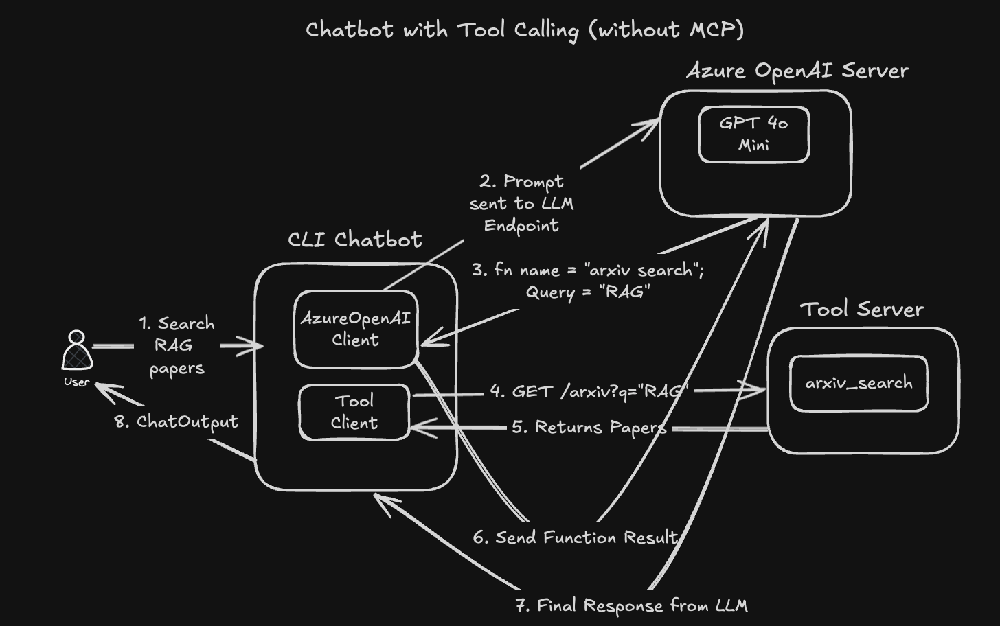
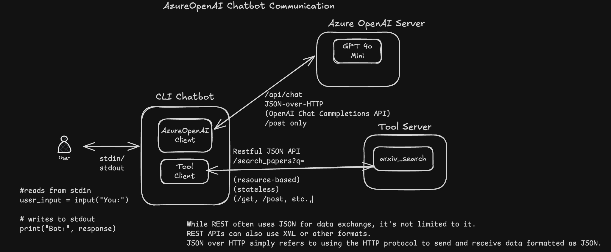

# 🧠 GPT 4-0 Mini Function-Calling Chatbot (with Arxiv Tool)

A locally hosted chatbot powered by Azure OpenAI GPT 4o Mini, capable of **function calling** to fetch research papers from [arXiv.org](https://arxiv.org/). Uses `FastAPI` for serving tools, and Docker for local orchestration.

---

## ⚙️ Project Structure

```
azure_openai_func_calling_without_mcp
├── app_server
│   ├── app_server.py
│   ├── Dockerfile
│   ├── logger_config.py
│   ├── paper_data
│   │   ├── mcp
│   │   ├── probability_distribution
│   │   ├── probability_in_daily_life
│   │   ├── voice_based_llms
│   │   └── voice-based_large_language_models
│   ├── requirements.txt
│   ├── server_logs.log
│   └── tools.py
├── docker-compose.yml
├── host
│   ├── azure_openai_client.py
│   ├── client_logs.log
│   ├── Dockerfile
│   ├── logger_config.py
│   ├── requirements.txt
│   └── tools_client.py

```

---

## What are we going to build?

- Logical components of the Chatbot


- How does the Input-Output Journey in the Chatbot happen? (though the below diagram is Ollama, the concept is still the same)


- How the Chatbot Communicates?



---

## 🚀 Getting Started

### ✅ Step 1: Make sure you are able to connect to Azure OpenAI

### ✅ Step 2: Start the Tool Server and Chatbot Client Containers
- From the project root:

1. Start the FastAPI app_server in detached mode

```bash
cd ollama_function_calling_without_mcp
docker compose up -d --build app_server
```

2. Start the chatbot client (host) in interactive mode

```bash
docker compose run --rm host
```
This gives you a live CLI interface like:

```bash
You: Show me papers on retrieval augmented generation
Bot: 📄 "Retrieval-Augmented Generation for Knowledge-Intensive NLP Tasks" — [arxiv.org/...]
```

---


### 📦 Requirements

```
Azure OpenAI API Access
Docker + Docker Compose
Internet access (for arXiv API)
```

---

### 🧩 Supported Tools

🔍 Arxiv Search
Function: arxiv_search(q: str, max_results: int = 5)

Example Prompt:

“Search latest papers on reinforcement learning in arXiv.”

---

How does the Communication happen between Client and Servers (Azure OpenAI Edition)

🔹 1. Client (CLI) → Azure OpenAI API
✅ Transport: HTTPS POST
✅ Protocol: JSON-over-HTTP (OpenAI Chat Completions API)
✅ Pattern:
- The client sends a message along with available tools_schema.
- Azure OpenAI may call a tool function by returning a tool_call in the response.

🔹 2. Client (CLI) → App Server (app_server)
✅ Transport: HTTP GET
✅ Protocol: RESTful JSON API
✅ Pattern:
- When Azure OpenAI chooses to call a function (search_papers or extract_info), the client hits the corresponding FastAPI endpoint:
/search_papers?topic=...&max_results=...
/extract_info?paper_id=...
- The result is passed back to Azure OpenAI to generate a final user-facing message.

🔹 3. Server Tool Definitions
✅ Tools are defined in JSON schema (tools_client.py) and passed to the Azure API.
✅ Tool execution is handled by the client logic (tools_client.py) that connects to FastAPI via requests.


---

## Result

### Logging outputs

- Refer to the files [app_server/server_logs.log](./app_server/server_logs.log) for server logs and [host/client_logs.log](./host/client_logs.log) for client logs

---

## ⚠️ Disclaimer

> While all the above code has been verified and tested to function correctly, please note that parts of this were generated via vibe coding — assisted by AI tools to accelerate experimentation. Review and adapt to your own development standards where needed.