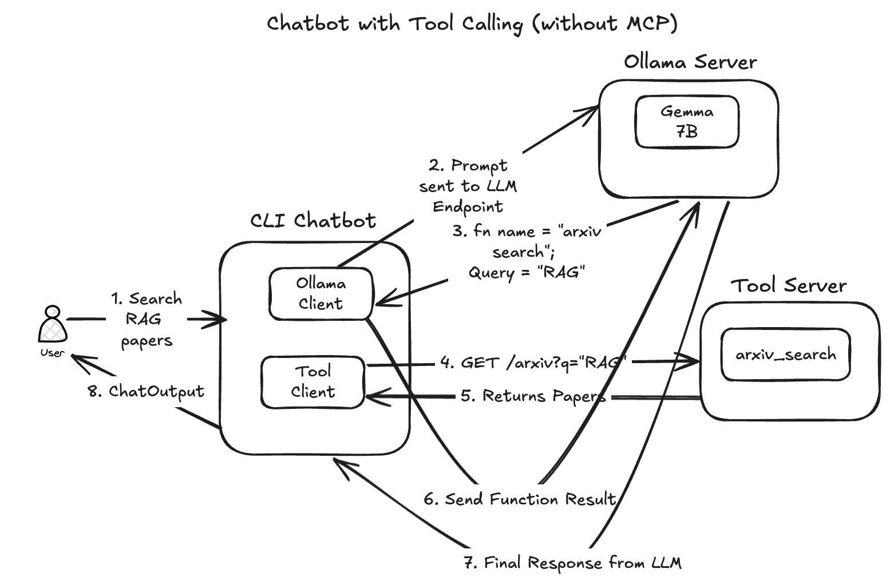
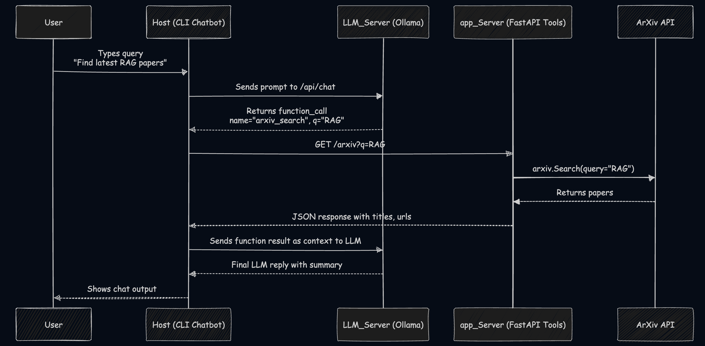

# 🧠 Ollama Function-Calling Chatbot (with Arxiv Tool)

A locally hosted chatbot powered by [Ollama](https://ollama.com), capable of **function calling** to fetch research papers from [arXiv.org](https://arxiv.org/). Uses `gemma:7b` as the LLM, `FastAPI` for serving tools, and Docker for local orchestration.

---

## ⚙️ Project Structure

```
.
└── ollama_function_calling_without_mcp
    ├── app_server
    │   ├── app_server.py
    │   ├── Dockerfile
    │   ├── requirements.txt
    │   └── tools.py
    ├── docker-compose.yml
    ├── host
    │   ├── cli_chatbot.py
    │   ├── Dockerfile
    │   ├── llama_client.py
    │   └── requirements.txt
    └── llm_server
        └── instructions.md
```

---

## What are we going to build?







---

## 🚀 Getting Started

### ✅ Step 1: Start the Ollama Server Manually

Make sure you have Ollama installed and run the LLM (e.g. `gemma:7b`) outside Docker.

```bash
ollama pull gemma:7b
ollama run gemma:7b
```

> This starts the Ollama LLM server at http://localhost:11434.

---

### ✅ Step 2: Start the Tool Server and Chatbot Client Containers
From the project root:

1. Start the FastAPI app_server in detached mode

```bash
docker compose up -d --build app_server
```

2. Start the chatbot client (host) in interactive mode

```bash
docker compose run --rm host
```
This gives you a live CLI interface like:

```bash
You: Show me papers on retrieval augmented generation
Bot: 📄 "Retrieval-Augmented Generation for Knowledge-Intensive NLP Tasks" — [arxiv.org/...]
```

---


### Optional Step: 🔎 Health Checks

#### ✅ Ollama Health Check
The chatbot will automatically check if Ollama is running using /api/tags.

If not reachable:

❌ Ollama server not reachable. Please start it with:

    ollama run gemma:7b

#### ✅ Tool Server Health Check
You can verify that the app server is up:

```bash
curl http://localhost:8000/health
# {"status": "ok"}
```

---


### 📦 Requirements

```
Ollama
Docker + Docker Compose
Internet access (for arXiv API)
```

---

### 🧩 Supported Tools

🔍 Arxiv Search
Function: arxiv_search(q: str, max_results: int = 5)

Example Prompt:

“Search latest papers on reinforcement learning in arXiv.”

---

## How does the Communication happen between Client and Servers

### 🔸 1. Client (CLI) → Ollama Server
- ✅ Transport: streamable HTTP POST to /api/chat
- ✅ Protocol: JSON-over-HTTP (streamed line-by-line)
- ✅ Pattern: Client sends a message; receives streamed JSON chunks


### 🔸 2. Client (CLI) → Tool Server (app_server)
- ✅ Transport: Standard HTTP GET request (/arxiv?q=...)
- ✅ Protocol: JSON response, synchronous
- ✅ Pattern: Traditional HTTP API call

### 3. Client is the orchestrator
The CLI (cli_chatbot.py) acts as:

- Router: handles the LLM response
- Function-caller: detects function_call and delegates to tools
- Memory holder: maintains history in context

---

---

## Result

### Version 1: Without enabling debugging

- Since we have used a quantized model for the web

```bash
WARN[0000] /path/to/ollama_function_calling_without_mcp/docker-compose.yml: the attribute `version` is obsolete, it will be ignored, please remove it to avoid potential confusion 
[+] Creating 1/1
 ✔ Container ollama_function_calling_without_mcp-app_server-1  Running                                                                                                                                      0.0s 

💬 Chat started. Type 'exit' or 'quit' to stop.

You: Hi
Bot: Hi there! 👋 

 
You: Search papers that talk about or use "Behaviour Link Graph"
Bot: **Relevant papers:**

**1. Behavior-Centric Link Prediction in Behavioral Link Graphs**
* Authors: Xiangnan Wang, Hongyuan Zha, et al.
* Publication: KDD, 2018
* Abstract: This paper proposes a link prediction model based on user behavior in behavioral link graphs.

**2. Learning Representation for Behavioral Link Graphs**
* Authors: Mengnan Wang, Hongyuan Zha, et al.
* Publication: AAAI, 2019
* Abstract: This paper explores representation learning techniques for behavioral link graphs, focusing on capturing the temporal dynamics of user behavior.

**3. Behavioral Link Graph Embedding for Recommendation**
* Authors: Zijian He, Hongyuan Zha, et al.
* Publication: SIGIR, 2019
* Abstract: This paper presents a recommendation system based on behavioral link graph embedding, which captures the relationships between items and users.

**4. A Survey on Behavioral Link Graphs: Representation, Inference, and Applications**
* Authors: Chenhao Tan, Hongyuan Zha, et al.
* Publication: arXiv, 2020
* Abstract: This paper provides a comprehensive overview of behavioral link graphs, covering representation models, inference algorithms, and applications.

**5. Learning Topic-Sensitive Behavioral Link Graphs for Recommendation**
* Authors: Xingxing Zhang, Hongyuan Zha, et al.
* Publication: AAAI, 2021
* Abstract: This paper proposes a method for learning topic-sensitive behavioral link graphs, which captures the relationships between items and topics.

**Additional resources:**

* **GitHub repository:** https://github.com/facebookresearch/BLG
* **Google Scholar search:** https://scholar.google.com/scholar?q=behavioral+link+graphs

**Keywords:**

* Behavioral Link Graphs (BLGs)
* Link prediction
* Representation learning
* Recommendation systems
* Social network analysis

You: quit    
👋 Exiting chat. Goodbye!

```

---

## Issue I encountered

### ❓What Happens When stream=False (default)?

✉️ Code Before:

```python
response = requests.post(
    "http://host.docker.internal:11434/api/chat",
    json={"model": "gemma:7b", "messages": messages}
    # stream=False is default
)
response.json()
```

📦 Protocol Used:
- Transport: Regular HTTP POST
- Response: Ollama buffers the entire response into a single JSON object
- Protocol style: blocking HTTP, not streaming

You get something like:

```json
{
  "message": {
    "role": "assistant",
    "content": "Hello there!"
  }
}
```

⚠️ Problem:

- If Ollama returns a streaming NDJSON response by default, requests still buffers it all — and the resulting response body may look like:

```json
{"message": {"role": "assistant", "content": "Hello"}}
{"message": {"role": "assistant", "content": " there!"}}
```
This is not valid JSON, and calling response.json() fails with:

JSONDecodeError: Extra data: line 2 column 1 (char 123)
Because you're trying to decode a multi-document stream as a single JSON object — which is invalid.

✅ What Changes with stream=True?

✉️ Code After:

```python
response = requests.post(..., stream=True)

```


📦 Protocol Used:
- Still HTTP POST, but now:
- You’re telling requests not to read the full body at once
- You read it line-by-line using response.iter_lines()
- Each line is a valid JSON object — NDJSON protocol


---

## ⚠️ Disclaimer

> While all the above code has been verified and tested to function correctly, please note that parts of this were generated via vibe coding — assisted by AI tools to accelerate experimentation. Review and adapt to your own development standards where needed.