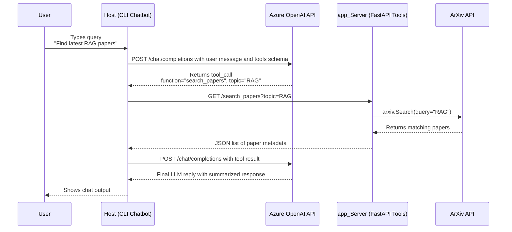

## Sequence Diagram

```mermaid
sequenceDiagram
    participant U as User
    participant Host as Host (CLI Chatbot)
    participant AOAI as Azure OpenAI API
    participant app as app_Server (FastAPI Tools)
    participant Arxiv as ArXiv API

    U->>Host: Types query<br/>"Find latest RAG papers"
    Host->>AOAI: POST /chat/completions with user message and tools schema
    AOAI-->>Host: Returns tool_call<br/>function="search_papers", topic="RAG"
    Host->>app: GET /search_papers?topic=RAG
    app->>Arxiv: arxiv.Search(query="RAG")
    Arxiv-->>app: Returns matching papers
    app-->>Host: JSON list of paper metadata
    Host->>AOAI: POST /chat/completions with tool result
    AOAI-->>Host: Final LLM reply with summarized response
    Host-->>U: Shows chat output
```

